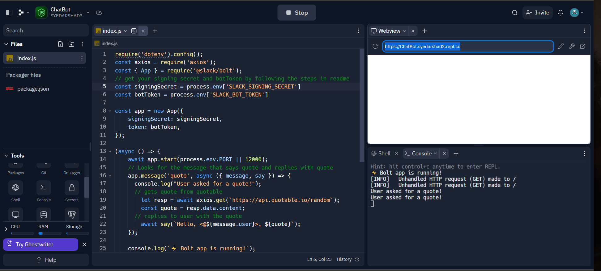

# ChatBotSlack

ChatBotSlack is a simple chatbot built using the Slack API and Node.js. It responds to messages containing the word "quote" with a random quote fetched from the https://api.quotable.io API.

## Functionalities
The Slack bot currently has two functionalities: quotes and jokes.
To use them, simply ask the bot "quote" to receive a randomly generated quote, or ask "tell me a joke" to receive a funny joke.

We are currently working on adding more options to the bot, so stay tuned for updates!

## Installation

To run this project, you'll need to do the following:

1. Clone the repository to your local machine.
2. Navigate to the project directory and run `npm install` to install all the required dependencies.
3. Create a new Slack App in your Slack workspace and add a new bot user to it. Make sure to note down the Signing Secret and Bot User OAuth Access Token values, as you'll need to use them later.
4. Create a new `.env` file in the root directory of the project, and add the following lines to it:
  SLACK_SIGNING_SECRET=your-signing-secret-here
  SLACK_BOT_TOKEN=your-bot-token-here
Replace `your-signing-secret-here` and `your-bot-token-here` with the actual values for your Slack App.

5. Run the command `npm start` to start the server.
6. In a separate terminal window, run the command `npm run ngrok` to start a local instance of ngrok and generate a public URL for your server.
7. In your Slack App's Event Subscriptions settings, enter the ngrok URL followed by `/slack/events` as the Request URL value.
8. Subscribe to the `message.channels` event in your Slack App's Event Subscriptions settings.
9. Send a message containing the word "quote" in a channel in your Slack workspace to test the bot.

## Running on Replit

To run this project on Replit, you can follow these steps:

1. Create a new Replit project and import the repository from GitHub.
2. Create a new `.env` file in the root directory of the project, and add the following lines to it:
  SLACK_SIGNING_SECRET=your-signing-secret-here
  SLACK_BOT_TOKEN=your-bot-token-here
Replace `your-signing-secret-here` and `your-bot-token-here` with the actual values for your Slack App.

3. Open the shell and run `npm install` to install all the required dependencies.
4. Run the command `npm start` to start the server.
5. In a separate terminal window, run the command `npm run ngrok` to start a local instance of ngrok and generate a public URL for your server.
6. In your Slack App's Event Subscriptions settings, enter the ngrok URL followed by `/slack/events` as the Request URL value.
7. Subscribe to the `message.channels` event in your Slack App's Event Subscriptions settings.
8. Send a message containing the word "quote" in a channel in your Slack workspace to test the bot.

>[Click here to see video demonstrations](./demonstrations/)

### JokeBot showing quotess when prompted  
 
### Execution of code in replit  

